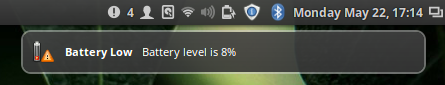
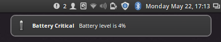

# Mint Battery Notification

The default battery low indicator in Linux Mint isn't great at notifying the user of a low batter. It shows no indication while using a fullscreen application and doesn't provide an audible sound when the batter is in a critical state.

This script will show two types of notifications. The first is a visual notification when your battery has reached a low level. The second is a visual and auditory notification when the batter has reached the critical level.

## Example




## Dependencies

This project is written in `Bash`, and tested with version *4.3* but other versions should work. `paplay` is used to play the notification sound, but this can be modified. `notify-send` is used to create the notification.

## Install

Download the most recent version from the releases page or checkout directly using git. Remember the location of your download, you will need it shortly.

Cron is used to check the battery level and I usually check the level every minute but this can be changed in the cron entry. To add an entry to cron using `crontab -e` and add the line below.

```
*/1 * * * * /path/to/battery-notify.sh
````

## Configuration

Almost all parts of the script can be set from the cron entry. For example to set the battery critical level you would modify the cron entry to match:

```
*/1 * * * * CRITICAL_LEVEL=8 /path/to/battery-notify.sh
````
### Available Configurations


| Variable | Description | Default |
|----------|-------------|---------|
| `SOUND_COMMAND` | The command that will play the notification sound | `paplay`
| `CRITICAL_LEVEL` | The battery level to show the critical alert | `5`
| `CRITICAL_ICON` | The icon to show for the critical notification | `battery-empty`
| `CRITICAL_SOUND` | The sounds to use for the critical notification | `"/usr/share/sounds/purple/alert.wav"`
| `LOW_LEVEL` | The battery level to show the low alert | `10`
| `LOW_ICON` | The icon to show for the low notification | `battery-caution`
| `LOW_SOUND` | The sounds to use for the critical notification | `""`

`CRITICAL_ICON` and `LOW_ICON` are any [icon that is supported][1] by `notify-send`. For `CRITICAL_SOUND` and `LOW_SOUND` if an empty string is provided there will be no audible notification.

## License

This project is released under the ISC license. See [LICENSE](./LICENSE).

[1]:[https://askubuntu.com/a/189262/18240]